# 🏦 Banking Microservices System – Spring Boot & Kafka

A real-world **Spring Boot Microservices backend system** demonstrating industry-level implementation of **REST APIs, Apache Kafka (event-driven communication), Eureka Service Discovery**, DTO validation, and clean layered architecture.  
Built with strong focus on **backend fundamentals, system design, and production-ready patterns**, suitable for Java Backend Developer roles**.


---

## 🚀 Tech Stack

- **Language & Frameworks:** Java 21, Spring Boot 3.x, Spring Web, Spring Data JPA  
- **Messaging & Microservices:** Apache Kafka, Eureka Server  
- **Database:** MySQL  
- **Build & Dependency Management:** Maven  
- **API Testing:** Postman

---

## 🧩 Architecture Overview

### Monolithic vs Microservices (Comparison)

| Monolithic Architecture | Microservices Architecture |
|-------------------------|----------------------------|
| Tightly coupled | Loosely coupled |
| Hard to scale | Independently scalable |
| Single deployment | Independent deployments |
| Single point of failure | Fault isolation |

📸 **Architecture Screenshots**

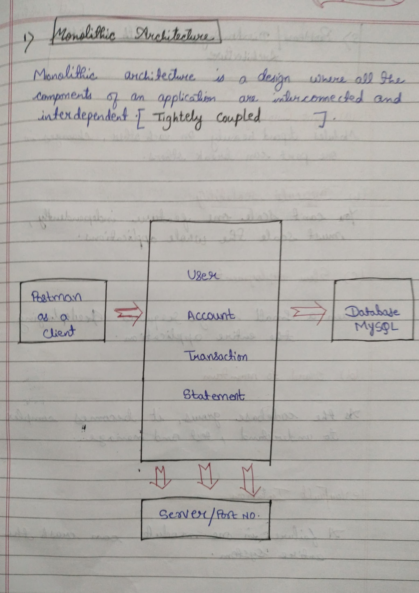
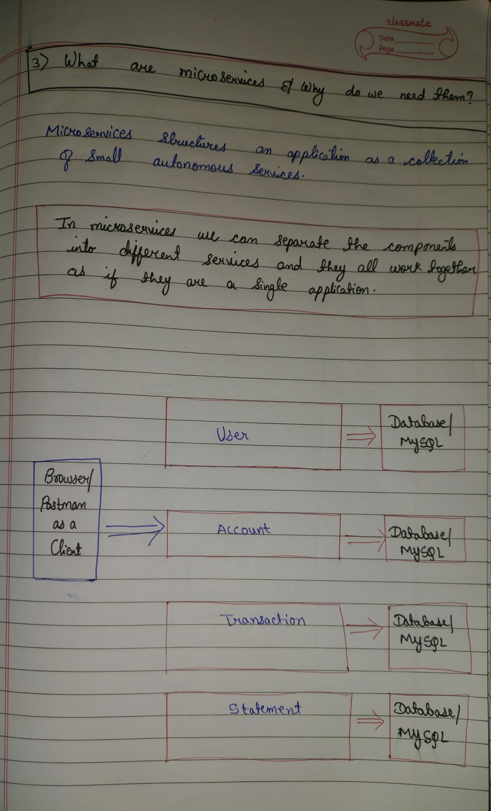

---

## 🏗️ System Architecture

### Services Implemented

| Service | Responsibility |
|-------|---------------|
| **User Service** | User CRUD & validation |
| **Account Service** | Kafka producer |
| **Statement Service** | Kafka consumer |
| **Transaction Service** | Transaction handling |
| **Eureka Server** | Service discovery |

📸 **Kafka-Based System Architecture**


---

## 🔍 Service Discovery – Eureka Server

All microservices register with **Eureka Server** for dynamic discovery and load balancing.

📸 **Eureka Dashboard**

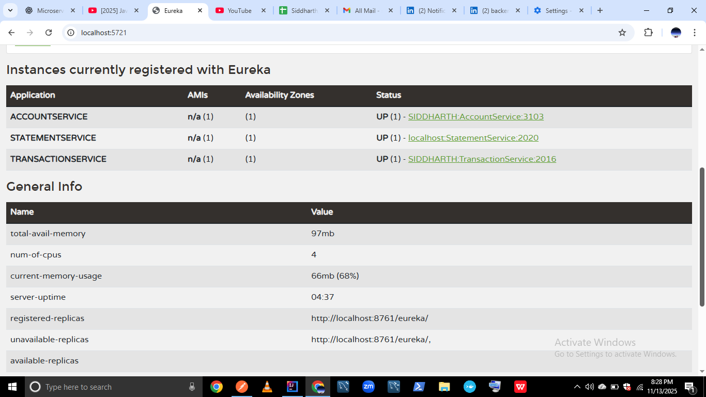

---

## 👤 User Service (REST APIs)

Manages **User CRUD operations** with DTO validation and global exception handling.

### Endpoints

| Method | Endpoint | Description |
|------|---------|------------|
| POST | `/api/users` | Create user |
| GET | `/api/users/{id}` | Get user by ID |
| PUT | `/api/users/{id}` | Update user |

📸 **User Service Screenshots**

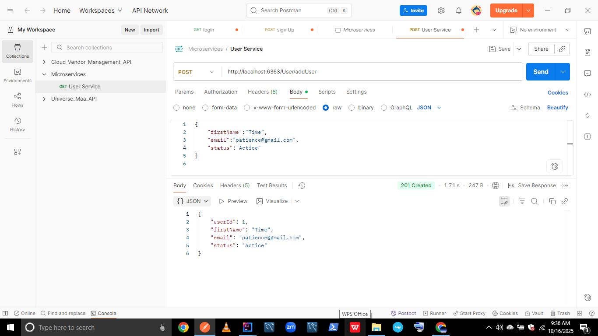
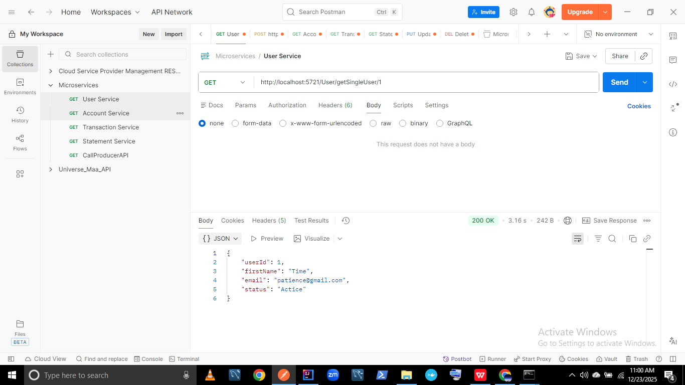
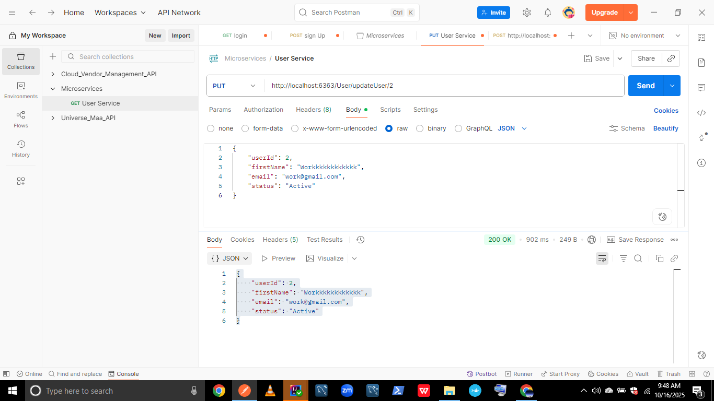
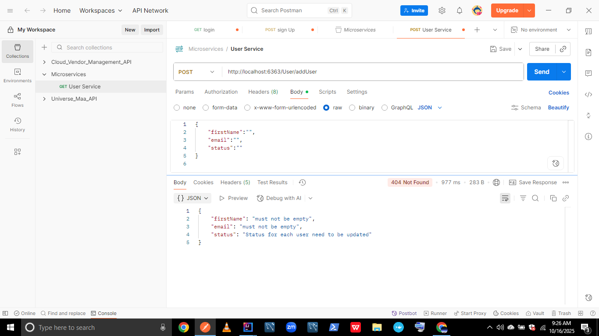

### Highlights
- DTO-based request/response  
- Validation using annotations  
- Global exception handling  
- Clean API responses  

---

## 🏦 Account Service (Kafka Producer)

Publishes **Kafka events** when account-related actions occur.

### Producer Flow
1. REST API receives request  
2. Event published to Kafka topic  
3. Consumer services process asynchronously  

📸 **Producer Logs & Response**

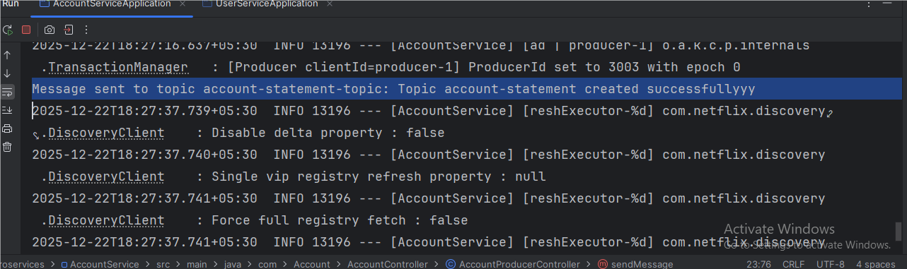
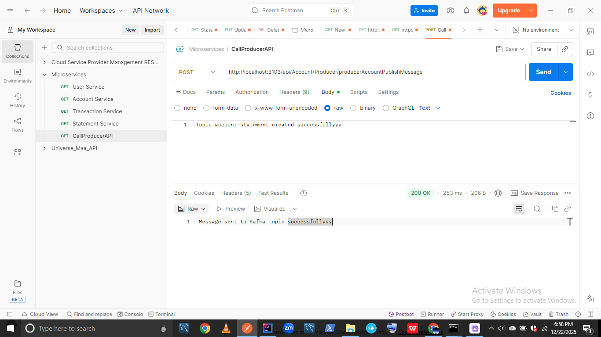

---

## 📄 Statement Service (Kafka Consumer)

Consumes Kafka events produced by Account Service.

📸 **Consumer Log**

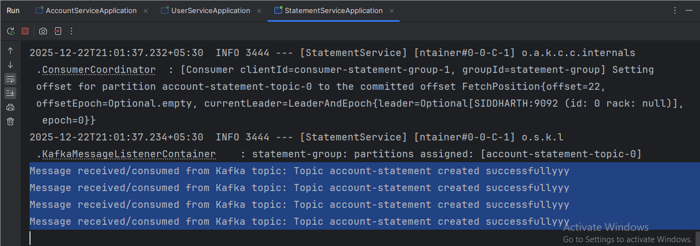

### Demonstrates
- Event-driven architecture  
- Kafka consumer groups  
- Loose coupling between services  

---

## 💸 Transaction Service

Handles transaction creation and retrieval.

📸 **Transaction APIs**

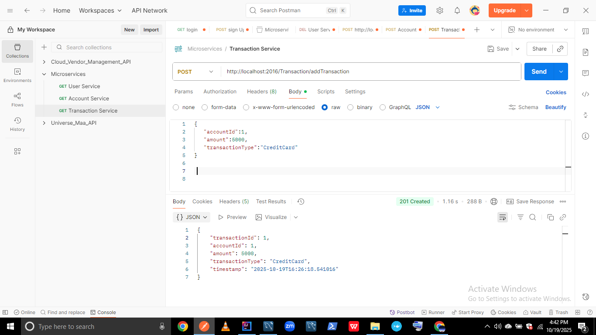
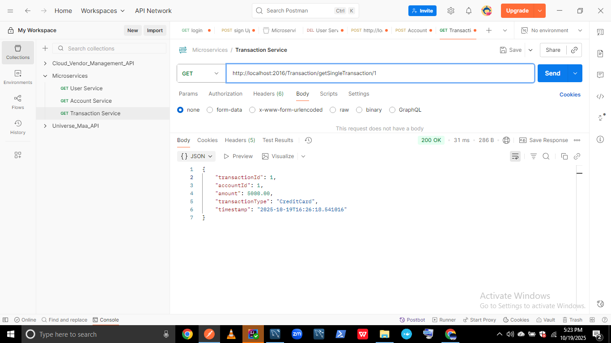

---

## ⚙️ Kafka & Zookeeper Setup (Local)

This project uses **Apache Kafka** for asynchronous communication between microservices.  
Zookeeper is required to manage Kafka brokers.

---

### 1️⃣ Start Zookeeper

```bash
zookeeper-server-start.bat config/zookeeper.properties
```
📸 **Zookeeper**

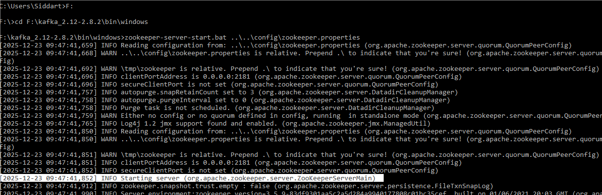


---

### 1️⃣ Start Kafka Broker

```bash
kafka-server-start.bat config/server.properties
```
📸 **Kafka Broker**

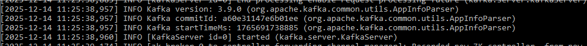

### ZooKeeper Info
- ZooKeeper starts automatically with Kafka (for older Kafka versions)  
- Modern Kafka versions support KRaft mode, which allows Kafka to run **without ZooKeeper**  
- Logs show successful startup and port binding:


---

### 1️⃣ Create Kafka Topic

```bash
kafka-topics.bat --create \
--topic account-statement-topic \
--bootstrap-server localhost:9092 \
--replication-factor 1 \
--partitions 1
```
📸 **Kafka Topic**

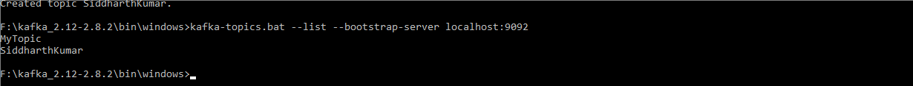
---

## 👨‍💻 Author

**Sidharth Kumar**  

[](mailto:siddharth0161820@gmail.com)  
[](https://www.linkedin.com/in/siddharthkumar16)  
[](https://github.com/siddharth0161820)

🙏 Built with dedication during my career break to master backend development. Connect for collaboration, job opportunities, or tech discussions.


